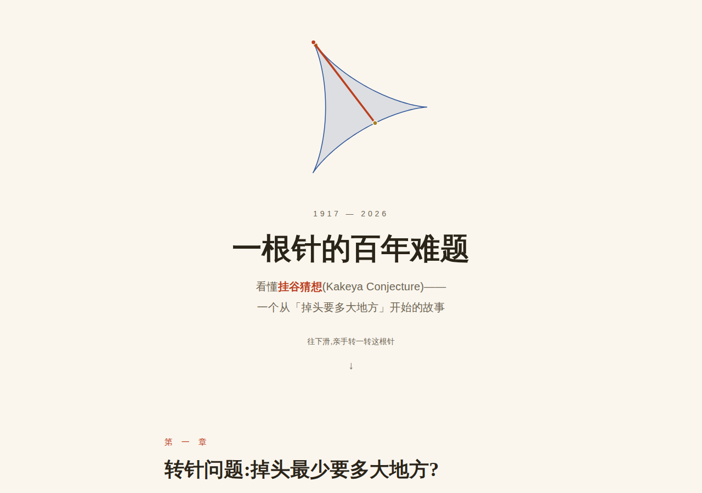

# random

随手做的一些小实验。

## 🪡 一根针的百年难题 —— 挂谷猜想可视化

**在线阅读:<https://ktmud.github.io/random/>**(GitHub Pages)

用可交互的动画,给普通读者讲清**挂谷猜想**(Kakeya Conjecture):
从 1917 年挂谷宗一「一根针如何调头」的小谜题,讲到贝西科维奇「面积可以任意小」的反直觉构造、
「零面积却满维度」的现代猜想,以及王虹与 Joshua Zahl 的 2025 年三维证明和 2026 年菲尔兹奖。

### 里面有什么

- **四块场地,同一根针** —— 圆 / 勒洛三角形 / 等边三角形 / 三尖摆线内的连续转针动画(同比例绘制,面积对比)
- **佩龙树** —— 切碎、平移、叠放:面积被一步步「折叠」掉,任意方向的针却都还在(面积由页面逐像素实测)
- **帕尔的戏法** —— 「斜一点、绕远路」,平移一根针几乎不花面积
- **接力调头** —— 佩龙树 + 帕尔机动合体:针在 8 根细条间接力转完整个扇区,扫过面积随偏角 δ 减小而下降
- **四份拷贝拼满 180°** —— 方向表盘 + 四份旋转拷贝轮流「值班」,补全调头路线的最后一步
- **数格子量维度** —— 盒计数演示:线段 ≈ 1 维、方块 ≈ 2 维、贝西科维奇式集合 ≈ 2 维(虽然面积趋于零)
- **三维针丛** —— 可拖拽旋转的三维挂谷集示意
- 里程碑时间线:1917 → 2025 证明 → 2026 菲尔兹奖

### 技术说明

- 单文件 `index.html`,零依赖、无构建,纯 Canvas + 原生 JS
- 三尖摆线中针的运动采用精确的切线弦参数化(针长恒等于 1,误差 ~10⁻¹⁶,发布前经数值验证)
- 等边三角形取高 = 针长,是帕尔定理的临界情形;顶点旋转的可用长度恰好为 1
- 佩龙树为简化版构造(每层右半部分左移固定比例,α = 0.42 为数值实验最优),面积为实时逐像素测量

### 延伸阅读

- Wang & Zahl, [*Volume estimates for unions of convex sets, and the Kakeya set conjecture in three dimensions*](https://arxiv.org/abs/2502.17655) (2025)
- Terence Tao, [*The three-dimensional Kakeya conjecture, after Wang and Zahl*](https://terrytao.wordpress.com/2025/02/25/the-three-dimensional-kakeya-conjecture-after-wang-and-zahl/)
- Quanta Magazine, [*“Once in a Century” Proof Settles Math’s Kakeya Conjecture*](https://www.quantamagazine.org/once-in-a-century-proof-settles-maths-kakeya-conjecture-20250314/)
- Quanta Magazine, [*Hong Wang Wins 2026 Fields Medal*](https://www.quantamagazine.org/hong-wang-wins-2026-fields-medal-the-third-woman-ever-20260723/)

---

*页面由 [Claude Code](https://claude.ai/code) 生成。*
